<div align="center">

<picture>
  <source media="(prefers-color-scheme: dark)" srcset="./assets/dark.svg">
  <source media="(prefers-color-scheme: light)" srcset="./assets/light.svg">
  
</picture>

<br/>


<a href="https://perainc.online"></a>
<a href="https://tr.linkedin.com/in/m-mustafa-kara"></a>
<a href="mailto:muhammedmustafa.kara0@gmail.com"></a>
<a href="https://github.com/deuskarao"></a>

<br/><br/>


</div>

<br/>

## About Me

I'm **M. Mustafa K.**, known as **Deus** — a Foreign Trade student building a parallel track in software development. I work across **Python, C, C#, Swift, and Kotlin**, with a particular focus on **cross-platform mobile development**, building the same product experience natively on both iOS (Swift/SwiftUI) and Android (Kotlin/Jetpack Compose) backed by a shared Supabase backend.

My background blends two disciplines: international trade and logistics, and hands-on software engineering — from mobile app architecture to backend data modeling. I hold a certification as a **Digital Forensics Specialist** *(Adli Bilişim Uzmanı)*, reflecting an interest in the security side of computing as well.

- 🌍 Foreign Trade student — Anadolu University
- 💻 Self-driven software developer, cross-platform mobile focus
- 🛡️ Certified Digital Forensics Specialist
- 🔭 Currently building **LifeOS** and **UniPulse**
- 📫 <a href="mailto:muhammedmustafa.kara0@gmail.com"></a>

**Open To:** internships and collaborative projects at the intersection of foreign trade, logistics tech, and mobile app development.

<br/>

## Tech Stack

**Languages**


**Mobile &amp; UI Frameworks**


**Backend &amp; Database**


**Tooling**


<br/>

## Featured Projects

<details>
<summary><b>LifeOS — Cross-Platform Personal Life Management App</b></summary>
<br/>

A personal life management app built natively for both platforms — **SwiftUI on iOS** and **Kotlin/Jetpack Compose on Android** — sharing a single **Supabase** backend so data stays in sync across devices. The Android build was engineered to mirror the iOS app pixel-for-pixel: same color palette, layout components, and screen behavior across Auth, Finance, and Settings.

| Aspect | Detail |
|---|---|
| **Stack** | Kotlin, Jetpack Compose, Swift, SwiftUI, Supabase |
| **Platforms** | iOS + Android (shared backend) |
| **Focus** | Pixel-accurate cross-platform UI parity |
| **Backend** | Supabase (Auth, data sync) |
| **Repository** | [github.com/deuskarao](https://github.com/deuskarao) |

LifeOS is a case study in building one product twice — matching design systems, animation, and component behavior across two completely different native UI toolkits without compromising on either platform's conventions.

</details>

<details>
<summary><b>UniPulse — University Management Platform</b></summary>
<br/>

A university management platform with full **Supabase** integration handling authentication, student profiles, departments, department courses, and student grades, plus **realtime channels** for live updates.

| Aspect | Detail |
|---|---|
| **Stack** | Supabase (Auth, Postgres, Realtime) |
| **Core modules** | Profiles, Departments, Courses, Grades |
| **Realtime** | Live data sync via Supabase channels |
| **Repository** | [github.com/deuskarao](https://github.com/deuskarao) |

Built to move beyond static, file-based data storage into a fully relational, realtime-capable backend for academic administration.

</details>

<br/>

## Certifications

**Security**


<br/>

## GitHub Analytics

<div align="center">


</div>

## GitHub Trophies

<div align="center">

</div>

## Contribution Activity

<div align="center">

</div>

## Current Focus

```yaml
Learning:
  - Advanced Kotlin and Jetpack Compose patterns
  - Supabase realtime architecture at scale
Building:
  - LifeOS (iOS + Android, shared backend)
  - UniPulse (university management platform)
Exploring:
  - Digital forensics and applied security
  - Foreign trade + logistics technology tooling
Open To:
  - Internships in mobile / backend development
  - Collaborative open-source projects
```

<br/>

## Connect With Me

<div align="center">

<a href="mailto:muhammedmustafa.kara0@gmail.com"></a>
<a href="https://tr.linkedin.com/in/m-mustafa-kara"></a>
<a href="https://github.com/deuskarao"></a>
<a href="https://perainc.online"></a>

</div>

<br/>

<div align="center">

*"Bridging trade and technology, one line of code at a time."*


</div>
